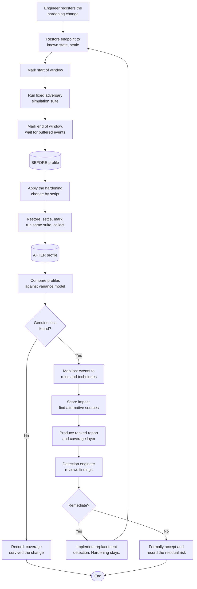

# T1 Proposal Revision Draft

Answers to the panel's revision items, written to drop into the research topic proposal form.

**How to use this file.** Each block below names the exact form section it belongs to and is
marked CHANGED (replace what is there) or NEW (add it). Paste the text into the matching cell
of the proposal form.

**Two decisions are marked ASSUMPTION.** They are my recommendation, not your instruction.
Change them if you disagree, and the affected sections change with them.

---

## Panel item to form section map

| Panel item | Form section | Status |
|---|---|---|
| New title | Proposed Title | CHANGED |
| Q9, expound algorithms | Area of Investigation, Algorithms to be Used | CHANGED |
| Q10 before and after | Reasons for Choice, The Current Process | CHANGED |
| Q6 repeatability | Reasons for Choice, Research Design | CHANGED |
| Q1, Q8 system type | Project Context, System Type and Deployment | NEW |
| Q3 input | Project Context, System Input and Prerequisites | NEW |
| Q4 compute process | Project Context, Processing Pipeline | NEW |
| Q2 report output | Project Context, System Output | NEW |
| Q11 adversary tests | Project Context, Adversary Simulation Tests | NEW |
| Q5 suggest fixes | Features and Capabilities, System Modules | CHANGED |
| Q7, revise diagram | Project Context, Activity Diagram | CHANGED |

Sections not listed here are unchanged. Statement of the Problems and the five Specific
Objectives keep their numbering. Nothing in this revision breaks the problem-to-objective
mapping.

---

# 1. Proposed Title (CHANGED)

The panel proposed:

> Detecting Security Blind Spots Through Pre- and Post-Hardening Events Using Differential
> Analysis Algorithm

**Recommended wording, which keeps the panel's words and corrects the grammar:**

> **Detecting Security Blind Spots Through Differential Analysis of Pre- and Post-Hardening
> Events**

Reason: "Using Differential Analysis Algorithm" is missing an article. English requires "a"
or "the" before a singular countable noun. The version above removes the problem by reordering
rather than by adding words, so it stays close to what the panel wrote.

If the panel prefers to keep the word "Algorithm", the minimal correction is:

> Detecting Security Blind Spots Through Pre- and Post-Hardening Events Using **a** Differential
> Analysis Algorithm

Raise this with the adviser as a question about wording, not as a correction of the panel.

**Note for Chapter 3.** The approved title names a general method rather than a specific one.
The specific algorithm must therefore be named and defined explicitly in the methodology
chapter.

---

# 2. Area of Investigation → Algorithms to be Used (CHANGED)

Replace the existing algorithm table with the table below. It adds a plain-language column and
states where each algorithm is applied, which is what the panel asked for.

| Algorithm or Technique | In plain terms | Where it is applied |
|---|---|---|
| Differential profile comparison | Line up the list of event types recorded before the change against the list recorded after, and find what is missing or reduced | Stage 3 of the pipeline, once per hardening change |
| Chi-square test of homogeneity | Decide whether the difference in how often an event type appears is larger than ordinary run-to-run variation | Stage 3, applied to every event type present in either profile |
| Poisson rate ratio with confidence bounds | Express the size of the drop as a ratio, such as "this event now occurs at one tenth of its former rate", with a stated margin of error | Stage 3, applied to every event type flagged as changed |
| Benjamini-Hochberg false discovery rate correction | When several hundred event types are tested at once, some will look unusual purely by chance. This adjusts the results so the number of false findings stays controlled | Stage 3, applied once across the full set of tests for a change |
| Coefficient of variation baseline modelling | Measure how much each event type naturally fluctuates when nothing is changed, and use that as the threshold a real loss must exceed | Built once from the control runs, then reused by every comparison |
| Weighted graph traversal over the event-rule-technique index | Follow the links from a lost event type, to the detection rules that read it, to the attack techniques those rules cover, and add up the damage | Stage 4, applied to every event type classified as lost or reduced |
| Naive event-count differencing (baseline) | Simply report any event whose count went down. No statistics. This is the comparison method, not part of the proposed system | Stage 3, run alongside the proposed method for evaluation |

## How the algorithms work together

The algorithms are not independent. They run in a fixed order, and each one narrows the work
of the next.

1. **Differential profile comparison** produces the candidate list. It answers "what looks
   different?" It is deliberately generous, because it is cheaper to discard a candidate later
   than to miss a real loss.

2. **The chi-square test** filters that list. It answers "is this difference larger than the
   noise this laboratory normally produces?" Event types that fail this test are discarded.

3. **The Poisson rate ratio** measures what survived the filter. It answers "how much was
   lost?" A rule that loses ten percent of its evidence is a different problem from one that
   loses all of it, and the ratio separates them.

4. **The Benjamini-Hochberg correction** is applied across the whole set of tests, not to any
   single test. Because several hundred event types are examined per change, ordinary chance
   alone would produce some apparently significant results. The correction holds the expected
   proportion of false findings to a declared level.

5. **The coefficient of variation model** is not applied at analysis time. It is built in
   advance from the control runs and supplies the variance figure the tests above depend on.
   Without it, the tests have no baseline to judge against.

6. **Weighted graph traversal** converts the surviving statistical findings into security
   findings. Up to this point the output is a list of event types. This step turns it into a
   list of detection rules and attack techniques, which is what a security team can act on.

The distinction the study rests on is between steps 1 and 2. Step 1 alone is the baseline
method already available to any engineer. Steps 2 through 5 are what the system contributes.

---

# 3. Reasons for Choice of Project → The Current Process (CHANGED)

Keep the existing text describing current practice. Append the following comparison, which
answers the panel's question about what engineers do now and what improves.

## What the security engineer does today

1. A required hardening change is identified, usually from a compliance benchmark or an audit
   finding.
2. The change is applied to a test group, then promoted to production.
3. A configuration scanner confirms the setting is now in effect. The scanner reports the
   change as compliant.
4. Business applications are exercised to confirm nothing broke operationally.
5. The change is signed off.

At no point does any step examine whether the detection rules still receive the data they
depend on. The affected rules remain enabled, continue to appear in coverage reports as active
controls, and produce no error.

## What changes with the proposed system

| Step | Today | With the proposed system |
|---|---|---|
| Confirm the setting applied | Configuration scanner | Unchanged. The scanner still does this. |
| Confirm applications still work | Functional testing | Unchanged. |
| **Confirm detection survived** | **Not performed** | **Performed automatically, with evidence** |
| Discover a blind spot | During an incident, an audit, or a red team exercise, typically months later | Immediately, at the time of the change |
| Know which rules are affected | Depends on an engineer remembering which rules read which data | Produced from an explicit, queryable index |
| Prioritise remediation | No basis for ranking | Ranked by a weighted impact score |

The essential point is that the system does not replace either existing verification step. It
adds the missing third one. A configuration scanner reports a correctly applied hardening
change as passing, because applying it is correct. It has no basis on which to report that the
same change removed the evidence a detection rule required.

---

# 4. Reasons for Choice of Project → Research Design (CHANGED)

Keep the existing paragraph. Insert the following subsection after it. It answers the panel's
question about guaranteeing that the pre-change and post-change activities are identical.

## Ensuring the pre-change and post-change runs are identical

The comparison is only valid if the configuration change is the sole difference between the
two capture windows. Four controls enforce this.

**1. The machine is returned to an identical starting state.**
Every capture window begins by restoring the endpoint from the same virtual machine snapshot.
The machine therefore starts each run with identical disk contents, identical installed
software, identical services and identical accumulated state. Nothing carries over from a
previous run.

**2. The stimulus is fixed and scripted.**
The same adversary simulation suite, pinned to a specific version and a fixed list of tests,
is executed in every capture window. The list is declared before data collection begins and is
not modified afterwards. No manual activity occurs on the endpoint during a capture window.

**3. The observation window is delimited from inside the telemetry.**
At the start and end of each window the system executes a uniquely named command that produces
one distinctive, easily identified event. All analysis is restricted to the events falling
between these two markers. This is more reliable than using the host clock, because it
measures the window in the same time base as the data itself and is unaffected by clock drift
or scheduling delay.

**4. Fixed settling and draining periods.**
Each run waits a fixed period after boot before the start marker, so that the burst of events
produced by system startup is excluded. Each run waits a further fixed period after the final
test before the end marker is considered complete, because the agent buffers events and the
manager writes them to disk with a short delay. Without this second wait, events belonging to
the window would be lost.

**5. The environment is version-locked.**
The versions of the monitoring platform, the endpoint sensor and its configuration, the
adversary simulation suite, the operating system build and the analysis code are all recorded
before the first run and are not changed until the last. Any change to these would make runs
from different periods incomparable, so a change of this kind requires the affected runs to be
discarded and repeated.

Together these controls mean that any difference observed between the pre-change and
post-change profiles is attributable to the configuration change, subject to the residual
run-to-run variation that the control runs measure and the statistical layer accounts for.

---

# 5. Project Context → System Type and Deployment (NEW)

> **ASSUMPTION.** This section answers the panel's question 8 by proposing a web-based system
> that uses an existing open-source agent rather than a newly written one. If you prefer a
> command-line tool with no web interface, tell me and this section, the pipeline section and
> Module 5 all change.

Insert after "Concept of the Proposed System".

## System Type and Deployment

The proposed system is a **web-based application**. It is not a desktop program, and it is not
distributed as an executable file that a user installs on a personal computer. It is installed
once on a server controlled by the security team, and users reach it through a web browser on
the internal network.

The system has three layers. Only two of them are built by this study.

| Layer | What it is | Built by this study |
|---|---|---|
| Collection layer | The Wazuh agent and the Sysmon endpoint sensor, installed on each monitored computer | **No.** These are established open-source components. The study configures them; it does not reimplement them. |
| Analysis layer | The differential comparison, statistical testing, impact scoring and remediation lookup | **Yes.** This is the contribution of the study. |
| Presentation layer | A web interface for defining a validation run, monitoring its progress, and reading the resulting report | **Yes.** |

The decision to use an existing agent rather than write one is deliberate. Endpoint log
collection is a solved problem with mature open-source implementations already deployed in
production environments. Writing another agent would consume development effort without
contributing anything original, and would produce a component less reliable than the one it
replaced. The contribution of this study is the analysis that no existing tool performs, not
the collection that several existing tools perform well.

The implementation language is Python, which is platform-independent. The analysis layer will
therefore run on Windows, Linux or macOS without modification. The monitored endpoints in this
study run Windows, and the log collection server runs Linux.

**Deployment in an organisation.** An organisation adopting the system installs the web
application on one internal server, points it at the log collection platform it already
operates, and uses the agents it has already deployed. No software is installed on endpoints
beyond what a monitored environment already runs.

---

# 6. Project Context → System Input and Prerequisites (NEW)

Insert after "System Type and Deployment". This answers the panel's question 3.

## System Input and Prerequisites

### What must already be in place before the system is used

The system validates an existing monitoring capability. It therefore assumes one exists. The
following must be in place beforehand.

1. A monitoring platform collecting security events, with full event archiving enabled so that
   all received events are retained, not only those that triggered an alert.
2. Endpoint sensors installed on the computers to be validated, forwarding events to that
   platform.
3. An index linking event types to the detection rules that consume them, and those rules to
   the adversary techniques they cover. The system builds this automatically from the rule set
   and allows manual correction.
4. The adversary simulation suite installed on the endpoint under test.
5. The ability to return the endpoint to a known state before each observation window.

### What the user supplies at the time of a validation run

The user is not required to know which detection rules will be affected. Determining that is
the purpose of the system. The user supplies only the following.

| Input | Description | Example |
|---|---|---|
| Change identifier and description | The hardening change being validated, and the benchmark control it comes from | "Disable Audit Process Creation subcategory, CIS Benchmark 17.6.2" |
| Target endpoint | The computer to be validated | WIN-EP-01 |
| Stimulus set | The list of adversary simulation tests to execute in both windows | A fixed named list, identical for every run |
| Observation window length | How long each capture runs | Fixed for the study |
| Change application method | The script that applies the hardening change | A version-controlled script |

### What the user does not need to supply

- Any prior knowledge of which event types the change will affect.
- Any prior knowledge of which detection rules depend on those event types.
- Any statistical parameters. The variance model is derived from the control runs.

---

# 7. Project Context → Processing Pipeline (NEW)

Insert after "System Input and Prerequisites". This answers the panel's question 4.

## Processing Pipeline: From Input to Output

Processing occurs in five stages. Each stage has a defined input and a defined output, and the
output of one stage is the input of the next.

### Stage 1. Acquisition

**Input:** the change definition, the target endpoint, the stimulus set.
**Process:** the system restores the endpoint to a known state, starts it, waits the settling
period, emits the start marker, executes the stimulus set, emits the end marker, waits the
draining period, then retrieves the archived events falling between the two markers. For the
post-change phase, the hardening change is applied by script after restoration and before the
stimulus.
**Output:** one archive of raw events per capture window, together with a manifest recording
the run identifier, the phase, the change identifier, and every pinned version.

### Stage 2. Normalisation and Profiling

**Input:** the raw event archive.
**Process:** each event record is parsed and reduced to the fields that define its event type.
Records from different sources use different formats and are converted to a common
representation. Occurrences of each event type are counted and expressed as a rate over the
observation window.
**Output:** a frequency profile, being a table of event types with their counts and rates.

### Stage 3. Differential Analysis

**Input:** the pre-change profile, the post-change profile, and the variance model built from
the control runs.
**Process:** the two profiles are aligned across the union of their event types, so that types
present in only one profile are handled explicitly rather than dropped. For each aligned event
type the system computes a chi-square test of homogeneity and a Poisson rate ratio with
confidence bounds, then applies the Benjamini-Hochberg correction across the full set of
comparisons. The naive differencing baseline is computed on the same data for comparison.
**Output:** every event type classified as lost, significantly reduced, unchanged, or newly
introduced, each with an effect size.

### Stage 4. Impact Scoring

**Input:** the classified event types, and the event-rule-technique index.
**Process:** for each event type classified as lost or significantly reduced, the system
traverses the index to enumerate the detection rules that consume it and the adversary
techniques those rules cover. A weighted impact score is computed from the severity of the
affected rules, the number affected, and the significance of the associated techniques. The
system then queries a substitution table for alternative event sources that remain available
and carry equivalent information.
**Output:** a ranked list of findings, each naming the lost evidence, the affected rules, the
affected techniques, an impact score, and any available alternative source.

### Stage 5. Reporting

**Input:** the ranked findings.
**Process:** the findings are rendered for the web interface and exported in machine-readable
form. A coverage layer is generated for the ATT&CK Navigator, shaded by what can no longer be
detected. For evaluation purposes, precision, recall, F1 score and false positive rate are
computed for both the proposed method and the baseline against the ground-truth set.
**Output:** the blind-spot report, the coverage layer, and the evaluation metrics.

---

# 8. Project Context → System Output (NEW)

Insert after "Processing Pipeline". This answers the panel's question 2.

## System Output: Contents of the Report

The report is the primary output. It contains four parts.

### Part 1. Run summary

Identifies the validation run and establishes that it was conducted under controlled
conditions: the change tested and its benchmark control identifier, the endpoint, the date,
the number of event types observed in each phase, and the pinned versions of every component.

### Part 2. Ranked findings

One entry per event type classified as lost or significantly reduced, ordered by impact score.
Each entry contains:

- the event type and its description;
- its rate before the change and after the change;
- the statistical result, stating whether the difference exceeds normal variation;
- the detection rules that consume the event type, with their severities;
- the adversary techniques those rules cover;
- the weighted impact score;
- any alternative event source that remains available and carries equivalent information.

An illustrative entry:

```
FINDING 1        Impact score 89        Classification: LOST

Event type    Windows Security 4688, Process Creation
Rate before   1,247 occurrences per window
Rate after    0 occurrences per window
Statistical   Loss confirmed. Exceeds the measured variance of this event
              type across the control runs.

Detection rules affected        12
  Rule 92052  Suspicious Process Creation           severity 12
  Rule 92053  Mshta Suspicious Execution            severity 12
  (10 further rules)

Adversary techniques affected    5
  T1059.001 PowerShell,  T1218.005 Mshta,  (3 further techniques)

Alternative source available
  Sysmon Event ID 1 records process creation and remains active in this
  environment. The twelve affected rules may be re-expressed against it.
```

### Part 3. Coverage layer

A file for the MITRE ATT&CK Navigator, shading each technique according to whether it remains
detectable after the change. This is presented in a format security teams already use for
coverage reporting, so the result can be read without learning a new representation.

### Part 4. Evaluation metrics (research output)

Precision, recall, F1 score and false positive rate for the proposed method and for the naive
baseline, computed against the same ground-truth set, together with the proportion of the
event-type space successfully analysed. This part exists to support the evaluation of the
study and is not required for operational use.

---

# 9. Project Context → Adversary Simulation Tests (NEW)

Insert after "System Output". This answers the panel's question 11.

## Adversary Simulation Tests

### What is used

The study uses **Atomic Red Team**, an open-source library of small, scripted tests that
reproduce individual adversary behaviours. It is published by Red Canary under an open licence
and is publicly available. Each test corresponds to a specific technique in the MITRE ATT&CK
framework and is documented with the exact commands it executes.

The library is used because the study requires the stimulus applied to the endpoint to be
identical in the pre-change and post-change windows. A scripted library provides this. Manual
testing does not, because a human cannot reproduce the same actions with the precision the
comparison requires.

The repository is cloned at a specific commit, recorded in the study, and then used offline
without further updates, so that the stimulus does not change during data collection.

### How tests are selected

Tests are selected on two criteria: they must execute reliably without manual interaction, and
they must exercise the event sources the hardening changes under test are expected to affect.
The selected list is fixed before data collection begins and is reported in full, so that the
experiment can be reproduced.

### Relationship to penetration testing

This distinction should be stated plainly, because the two are often confused.

| | Penetration testing | Adversary simulation as used here |
|---|---|---|
| Goal | Discover whether a system can be compromised | Determine whether known behaviours are recorded |
| Method | A human tester, adapting to what is found | A fixed script, identical every time |
| Result | A report of exploitable weaknesses | A record of what the system logged |
| Repeatable | No. Each engagement differs | Yes. This is its purpose |

Atomic Red Team is **not** a penetration testing tool and this study does not perform
penetration testing. It executes known behaviours in order to observe what the monitoring
system records. It does not attempt to compromise the target, does not chain techniques into
an attack path, and does not adapt based on what it finds.

The techniques used are nevertheless the same techniques observed in real intrusions, which is
what makes the resulting telemetry representative. The value of the approach for this study is
its repeatability, not its realism as an attack.

### Safety and scope

All tests are executed inside an isolated laboratory on virtual machines that are restored to
a known state before every run and have no route to any production system or to the internet
during a capture window. No test is executed against any system outside the laboratory.

---

# 10. Project Context → Features and Capabilities (CHANGED)

Replace the existing list with the list below. Items marked with an asterisk are additions
made in response to the panel's questions.

- Automated, repeatable capture of security event telemetry across defined pre-change and
  post-change observation windows
- Orchestrated execution of a scripted adversary simulation suite to guarantee identical
  stimulus across capture windows
- Delimitation of each observation window by markers emitted into the telemetry itself, rather
  than by host clock time \*
- Normalisation of heterogeneous event formats from endpoint, operating system and network
  sources into a unified event-type profile
- Variance modelling of each event type derived from repeated control runs in which no
  configuration change is applied
- Differential alignment of pre-change and post-change profiles with statistical significance
  testing and false discovery rate correction
- Classification of each event type as lost, significantly reduced, unchanged, or newly
  introduced
- Dependency mapping from lost event types to the detection rules and MITRE ATT&CK techniques
  that consume them
- Computation of a weighted blind-spot impact score and generation of a ranked remediation list
- **Identification of alternative event sources that remain available and carry information
  equivalent to a lost source, presented as candidate substitutions for the affected rules** \*
- A web interface through which a validation run is defined, monitored and reviewed \*
- Exportable reports and a coverage layer suitable for visualisation in the MITRE ATT&CK
  Navigator
- Retention of experiment metadata enabling any validation run to be reproduced and audited

## On the suggestion of remediation

> **ASSUMPTION.** This is my recommended answer to the panel's question 5. It commits to a
> limited, achievable form of remediation support. Tell me if you want it removed or expanded.

The panel asked whether the system can suggest a fix for a blind spot it identifies. The
system provides a defined and deliberately limited form of this.

**What it does.** When an event type is classified as lost, the system consults a substitution
table describing which event sources carry equivalent information. Where an alternative source
is present in the environment and is confirmed still active in the post-change profile, the
system reports it alongside the finding, together with the affected rules that could be
re-expressed against it.

**What it does not do.** The system does not rewrite detection rules automatically, and it does
not generate new detection logic. Deciding whether a substitution preserves the detection
intent is an engineering judgement, and the system presents candidates for a human to evaluate
rather than applying them.

**What it will never do.** The system does not recommend reversing or weakening the hardening
change. The hardening change is a required security control and remains in place. Remediation
is directed at restoring detection coverage, not at removing the control that reduced it. This
distinction is fundamental to the study: the premise is that hardening and detection are both
necessary, and that the loss of one in pursuit of the other should be made visible rather than
accepted silently.

---

# 11. Project Context → System Modules (CHANGED)

The five modules are retained. Modules 4 and 5 are amended.

**Module 1, Telemetry Acquisition and Experiment Control Module.** Unchanged.

**Module 2, Event Normalization and Profiling Module.** Unchanged.

**Module 3, Differential Alignment and Statistical Analysis Module.** Unchanged.

**Module 4, Blind-Spot Impact Scoring and Coverage Mapping Module.** Amended. In addition to
maintaining the dependency index, traversing it for each lost event type and computing the
weighted impact score, this module now consults a substitution table to identify alternative
event sources that remain available and carry equivalent information, and reports them with
the finding. It does not modify detection rules.

**Module 5, Reporting, Visualization, and Experiment Validation Module.** Amended. In addition
to generating the ranked report, the profile comparison views, the ATT&CK Navigator layer and
the evaluation metrics, this module now provides the web interface through which a validation
run is defined, its progress monitored, and its results reviewed.

---

# 12. Project Context → Activity Diagram (CHANGED)

The panel asked for the activity diagram to be revised and explained in plain terms. Replace
the existing narrative with the following, and replace the diagram image with one drawn from
the flow below.

## The activity diagram in plain terms

The diagram has four columns, each showing who or what performs the steps in it.

| Column | Who or what |
|---|---|
| 1 | The Security or Systems Engineer, the person applying the hardening change |
| 2 | The proposed system |
| 3 | The monitored environment: the endpoint and the log collection platform |
| 4 | The Security Detection Engineer, the person who acts on the findings |

The flow proceeds as follows.

1. The engineer registers the hardening change to be validated and selects the target endpoint.
2. The system returns the endpoint to its known starting state and waits for it to settle.
3. The system marks the start of the observation window inside the telemetry.
4. The system runs the fixed adversary simulation suite. The endpoint records events as it
   normally would, and forwards them to the log collection platform.
5. The system marks the end of the window, waits for buffered events to arrive, and collects
   the recorded events. **This is the before profile.**
6. The engineer applies the hardening change, or the system applies it by script.
7. Steps 2 to 5 are repeated without any other alteration. **This is the after profile.**
8. The system compares the two profiles and determines which event types were lost or reduced,
   using the variance measured from the control runs to distinguish a genuine loss from
   ordinary fluctuation.
9. **Decision point.** Was any genuine loss found?
   - **No:** the system records that detection coverage survived the change, and the flow ends.
     A negative result is recorded rather than discarded, because evidence that a change is
     safe is itself useful.
   - **Yes:** the flow continues.
10. For each loss, the system identifies the detection rules that depended on the lost evidence
    and the adversary techniques those rules covered, computes an impact score, and checks
    whether an equivalent alternative source is still available.
11. The system produces the ranked blind-spot report and the coverage layer.
12. The detection engineer reviews the report and decides, for each finding, whether to write a
    replacement detection, adopt the suggested alternative source, or formally accept the risk.
13. Where a replacement detection is implemented, the validation is run again to confirm the
    coverage has been restored. **The hardening change remains in place throughout.**

## Diagram source

The following renders as a flowchart and may be used to redraw the diagram. It shows the main
path; the four columns above indicate which party performs each step.



---

# Items still to confirm

| Item | Status |
|---|---|
| Web-based system with existing agent | **ASSUMPTION.** Confirm or change. |
| Limited remediation suggestion | **ASSUMPTION.** Confirm or change. |
| Final title wording | Raise the grammar question with the adviser |
| Revision submission deadline | Not known |
| Whether the Gantt chart needs adjusting for the added web interface work | Not yet reviewed |
